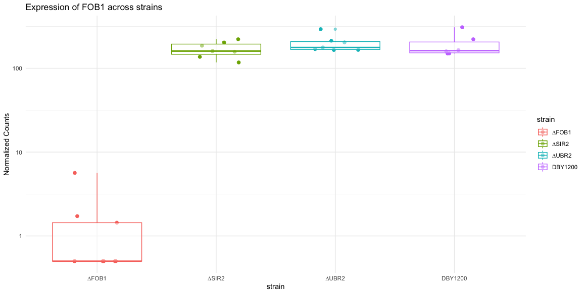
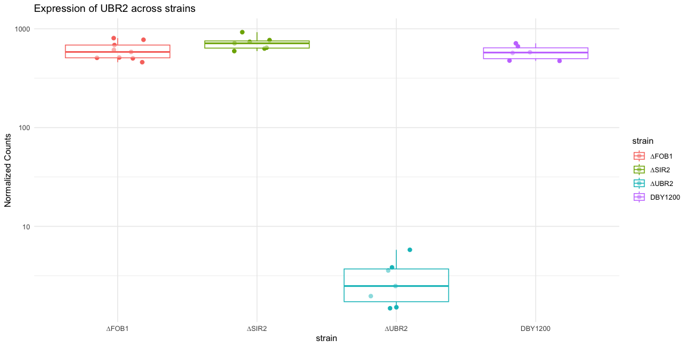

# Analysis of Aging in S. cerevisiae

A long time ago I supremely messed up a take home assignment for a job interview and altered the course of my life forever. I got over losing the job opportunity but always wanted to figure out the problem I misunderstood back then. Namely,

>How do you do differential expression analysis when there are multiple time points and multiple strains?

Turns out it's not so hard at all and the DESeq2 package does most of the work for you. However, it's nice to finally understand how linear models are used in this kind of analysis.

## Write Up

So I have all the basic ingredients for an RNASeq analysis... A mangled sample sheet and raw expression counts for each sample. 

### Step 1: I/O and Utils
I'll start by providing some utility functions.

```R
library(DESeq2)
library(dplyr)
library(ggplot2)


read_col_data <- function(sample_sheet_path) {
  sample_sheet <- read.table(sample_sheet_path, header=TRUE)
  sample_sheet$age = factor(sample_sheet$age)
  sample_sheet$strain = factor(sample_sheet$strain)
  row.names(sample_sheet) = sample_sheet$name
  return(sample_sheet)
}

merge_count_files <- function(directory, sample_sheet, count_column = 2, id_column = 1) {
  count_list <- list()
  for(i in 1:nrow(sample_sheet)) {
    count_file = sample_sheet$filename[i]
    data <- read.table(paste(directory, count_file, sep = ""), header = FALSE, sep = "\t", stringsAsFactors = FALSE)
    sample_name <- sample_sheet$name[i]
    count_data <- data %>%
      select(!!id_column, !!count_column) %>%
      rename(TranscriptID = !!id_column, !!sample_name := !!count_column)
    count_list[[sample_name]] <- count_data
  }
  
  # Merge all data frames by the TranscriptID column
  merged_counts <- Reduce(function(x, y) full_join(x, y, by = "TranscriptID"), count_list)
  merged_counts[is.na(merged_counts)] <- 0
  
  # Change row names to values in the first column
  row.names(merged_counts) = merged_counts$TranscriptID
  merged_counts$TranscriptID = NULL
  
  return(merged_counts)
}

order_and_filter_results <- function(res, padj_threshold=0.05) {
  ordered = res[order(res$pvalue), ]
  filtered = ordered[which(ordered$padj<padj_threshold),]
  return(filtered)
}

plot_gene_expression <- function(dataset, standard_name, systematic_name) {
  df <- plotCounts(dds, gene=systematic_name, intgroup="strain", returnData=TRUE)
  ggplot(df, aes(x=strain, y=count, color=strain)) +
    geom_jitter(width=0.2, size=2) +
    geom_boxplot(alpha=0.5) +
    scale_y_log10() +  # Log-scale for better visualization
    labs(title=paste("Expression of", standard_name, "across strains"), y="Normalized Counts") +
    theme_minimal()
}
```

### Step 2: Design of Experiment and choice of Statistical Test
Then I read in the data I have and transform it into a DESeq dataset object. Since my experiment has two conditions, time and genotype I set the design to be `~ strain + time + strain:time`.

This is where I went wrong originally. From what I understand, because my experiment has more than one condition, it is better to use LRT as my statistical test as opposed to Wald. If I were to simply use the default Wald test the other condition would basically act as a confounder! So here are my commands:

```R
## Summarize differential expression
## Using the provided sample-level counts and sample sheet answer the following questions:
colData = read_col_data("calico_data_challenge_samplesheet.tsv")
countData = merge_count_files("RNAseq_counts/", colData)
dds <- DESeqDataSetFromMatrix(countData=countData, colData=colData, design=~age + strain + strain:age)
```

### Step 3: Sanity Checks
At this point, I thought it would be wise to do some sanity checks. I have three knockout mutants, right? So the expression of those genes should be near zero in their corresponding samples. RIGHT?!

```R
## Sanity Checks
## The counts of Knocked-out Genes should be lower in the corresponding strain
plot_gene_expression(dds, "FOB1", "YDR110W")
plot_gene_expression(dds, "SIR2", "YDL042C")
plot_gene_expression(dds, "UBR2", "YLR024C")
```

This results in the following plots:





So far so good (I think)

## Step 4: Test for Differentially Expressed Genes
Now the main event:
```R
## Which genes are differentially expressed based on age?
dds_age <- DESeq(dds, test = "LRT", reduced = ~ strain)
results_age = results(dds_age)

## Which genes are differentially expressed based on Genotype?
dds_genotype <- DESeq(dds, test = "LRT", reduced = ~ age)
results_genotype = results(dds_genotype)

## Which genes are differentially expressed based on genotype-specific aging?
dds_interact <- DESeq(dds, test = "LRT", reduced = ~ age + strain)
results_interact = results(dds_interact)
```

The Log-Ratio Test compares my main GLM: `~ strain + age + strain:age` to simpler ones. This should isolate the effects of each condition.
